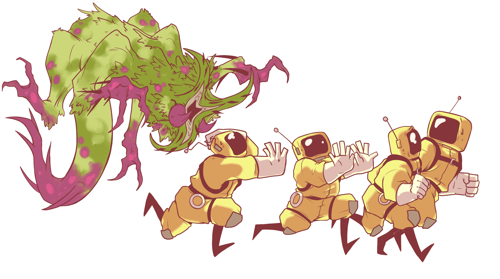
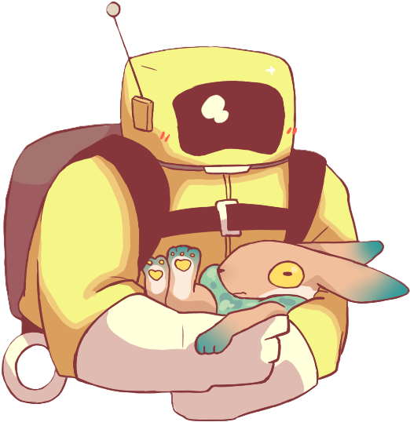

<header class="masthead">
	

    	

    		
MINDARO

      	

		

        	

          		
Descend the dangerous depths of Mindaro, a 1-6 player co-op action-horror game. Navigate caves, biomes, and industrial ruins while scavenging for survival and uncovering hidden secrets.

      		

    	

    

</header>
<!-- Video -->
<section class="page-section" style="background-color:#556776">
    

      	

        	<video width="60%" height="60%" controls="false" autoplay="" loop="true" muted="">
          		<source src="assets/BBS_Trailer.mp4" type="video/mp4">
        	</video>
      	

    

</section>
<!-- End Video Grid -->
<!-- Discord/Steam links -->
<section class="page-section" style="padding-top: 100px; padding-bottom: 100px">
    

		

        	

          		<h2 class="section-heading text-uppercase">Join our community!</h2>
        	

      	

		

        	

          		<iframe src="https://store.steampowered.com/widget/3879330/" frameborder="0" width="646" height="190"></iframe>
        	

			
 
				<iframe src="https://discord.com/widget?id=1332207802327765064&theme=dark" width="350" height="190" allowtransparency="true" frameborder="0" sandbox="allow-popups allow-popups-to-escape-sandbox allow-same-origin allow-scripts"></iframe>
      		

		

        

        	
    	

    

</section>
<!-- End Discord/Steam links -->
<!-- Development Stage -->
<section class="page-section" style="background-color:#556776; padding-top: 100px; padding-bottom: 100px">
    

		

        	

          		<h2 class="section-heading text-uppercase">Development Stage</h2>
        	

      	

		

        	

          		

					
We are pleased to provide a formal update on our game's development. The project has now exceeded the 50% completion mark, with all core functionalities successfully implemented. Our current efforts are concentrated on content creation, refinement, and quality assurance to ensure a polished final product.

					
We are on track to meet our projected release date in late April.

					
In preparation for launch, we are conducting a closed beta test exclusively on our Discord server. This testing phase allows us to gather critical feedback from our community. We invite you to join our Discord to participate and contribute to the final stages of development.

				

        	

      	

    

</section>
<!-- End Development Stage -->
<!-- How It Started -->
<section class="page-section" style="padding-top: 100px; padding-bottom: 100px">
    

		

        	

          		<h2 class="section-heading text-uppercase">How it Started</h2>
        	

      	

		

        	

          		

					
The initial spark came from the narrative and atmosphere of Made in Abyss. We were captivated by its sense of mystery and the thrilling, perilous journey into the unknown. The idea of a world that unfolds as you delve deeper, revealing new wonders and dangers with every step, became a core pillar of our game's story.

					
Next, we looked at gameplay. The high-tension, cooperative action of Lethal Company was a major influence. We wanted to capture that shared sense of risk and camaraderie that forms when you're working together in a hostile, unpredictable environment. That feeling of facing overwhelming odds with your friends is a key part of our design.

					
Finally, we drew inspiration from the strategic elements and resource management of Repo. The unique pressure of timed objectives and making difficult choices under pressure shaped our gameplay loop, ensuring that every decision feels meaningful and impactful.

					
By blending the deep exploration of Made in Abyss, the heart-pounding teamwork of Lethal Company, and the strategic depth of Repo, we're not just making a game—we're creating an experience that is a true love letter to the titles that inspired us.

				

        	

			

        		
    		

      	

    

</section>
<!-- End How It Started -->
